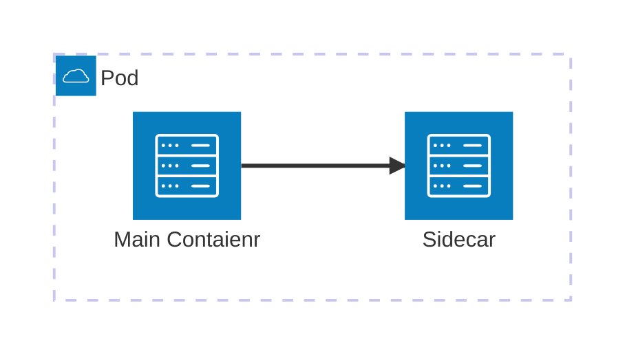
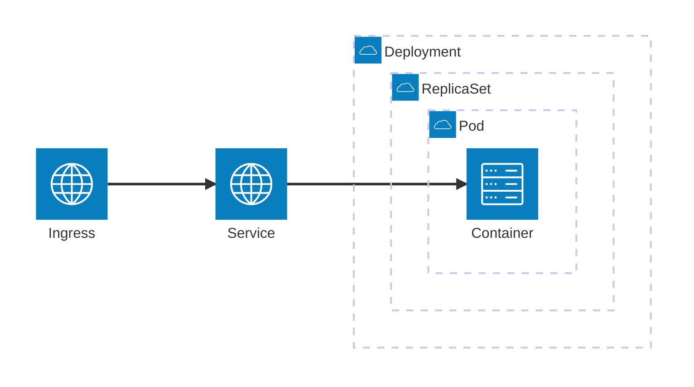
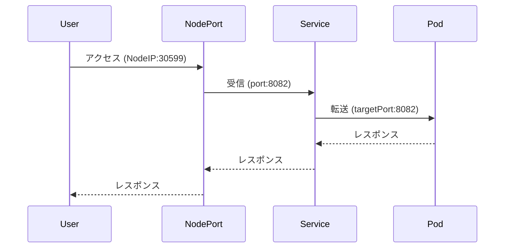



[つくって、壊して、直して学ぶ Kubernetes入門](https://www.shoeisha.co.jp/book/detail/9784798183961)を読んだ覚え書き。

## モチベーション
- ハンズオン形式でkubernetesを触りたい
- 壊して直して学ぶというコンセプトが面白そう

## 全体像

Podが最小の単位｡Podには1つ以上のContainerが動いている｡  
メインとなるContainerの他の補助的なContainerをSidecarと呼ぶ


IngressからContainerにアクセスするまでにたどるコンポーネント｡


## Pod, Containerのデバッグをする

ProductionのContainerイメージはshellが入っていないケースがままある｡  
この場合 `kubectl debug` コマンドでdebug用のContainerを作成することで操作が可能になる｡

```sh
kubectl debug -it <debug対象のPod名> --image=<debug用Containerイメージ> --target=<debug対象のContainer名> -- sh
```

shellが入っている場合は `kubectl exec`でアクセスできる｡

```sh
kubectl exec -it <Pod名> -- /bin/sh
```

## Service

ServiceのNodePortを使ったときの port, targetPort, nodePort の関係性｡



## ConfigMap

ConfigMapから取得した環境変数はアプリケーションを再起動しないと反映できない｡

```sh
kubectl rollout restart deployment/hello-server
```


## Probe

Readiness Probe
- Podのすべてのライフライクルでチェックされる
- Serviceリソースの接続対象とするかを判定
- http status codeが200~400であればOKとみなす

Liveness Probe
- Podを再起動する
- Readiness Probeと同時に使用できる
	- initialDelaySeconds は Readiness > Liveness となるようにする

Startup Probe
- コンテナ起動時にのみチェックされる
- Startup Probeが成功するまで､Readiness, Livenessのチェックは実行されない

## QoS Classes (Quolity of Service)

- resource.requests ... Containerが必要とするリソース量(CPU, Memなど)
- resource.limits ... Containerが使用できるリソース上限

resourceの設定状況によってOOMKillされる優先度が変化する｡3種類のQoS Classによって順番が決まる｡
1. Guaranteed: Pod内の全てのContainerにrequests, limitsの両方が指定している
2. Bustable: Pod内のいずれかのContainerにrequestsまたはlimitsが指定されている
3. BestEffort: 上記以外

## よく見かけたコマンド

```shell
kubectl apply -f <manifest.yaml>
kubectl delete -f <manifest.yaml>
kubectl get <resource type> <resource name>
kubectl describe <resource type> <resource name>
kubectl logs <pod名>
kubectl edit <resource type> <resource name>
```

## Kustomize

manifest.yamlに限らずyamlファイル全般で､共通部分と環境ごとの差分を管理できる｡  
便利そう｡

```
❯ tree
.
├── base
│   ├── deployment.yaml
│   └── kustomization.yaml
└── overlays
    ├── production
    │   ├── deployment.yaml
    │   ├── kustomization.yaml
    │   └── pdb.yaml
    └── staging
        └── kustomization.yaml
```

```cardlink
url: https://github.com/kubernetes-sigs/kustomize
title: "GitHub - kubernetes-sigs/kustomize: Customization of kubernetes YAML configurations"
description: "Customization of kubernetes YAML configurations. Contribute to kubernetes-sigs/kustomize development by creating an account on GitHub."
host: github.com
favicon: https://github.githubassets.com/favicons/favicon.svg
image: https://opengraph.githubassets.com/aaf180fc3d39f42c5d00c9d19dcae2f0ae4bed39ab3d5ec2dbc1c40e4b434ad0/kubernetes-sigs/kustomize
```



## 感想
壊して学ぶという言葉通りに､異常が起きたときにどういった観点で調査するか学べるのがとてもよかった｡手を動かしつつも写経にはならず､調べる順序や理由､観点が説明されていて覚えやすかった｡Chapter8では､これまでの内容を振り返る形の実践形式の内容があり､ちょうどよい難易度で楽しめた｡
