## 細かい話なんてどうでもいいから､早くおみくじが引きたいよ

[おみくじ / Omikuzi](omikuzi.nagu.dev)

おみくじを引いた様子｡
<blockquote class="bluesky-embed" data-bluesky-uri="at://did:plc:zumi64soisjbkkh72emx4c6y/app.bsky.feed.post/3lhvhc7ss6s2j" data-bluesky-cid="bafyreihwma32tuilvfutyog4es6nv6iu4f6np7c65mnei6npiu24o2dsv4">
今日の運勢は「吉」でした！
omikuzi.nagu.dev  <a href="https://bsky.app/profile/did:plc:zumi64soisjbkkh72emx4c6y/post/3lhvhc7ss6s2j?ref_src=embed">[image or embed]</a>
&mdash; chika 🌱 (<a href="https://bsky.app/profile/did:plc:zumi64soisjbkkh72emx4c6y?ref_src=embed">@chikast.bsky.social</a>) <a href="https://bsky.app/profile/did:plc:zumi64soisjbkkh72emx4c6y/post/3lhvhc7ss6s2j?ref_src=embed">2025年2月11日 19:30</a></blockquote>

## はじめに

2025.01.03  
新年早々、事件が起きた｡昨年引っ越しをして迎える初めての初詣。寒空を突き抜けた先で待ち受けていたのは――見事なまでに賑わいゼロの神社。

ぽつんと置かれた賽銭箱の隣には「おみくじ200円」とプリントアウトした紙が貼られた閉店シャッターが見えるのみ。当然、おみくじなんて引けるはずもなく...｡新年幕開けにもかかわらず幸先がよろしくないと焦りに焦った結果、気づいたときにはなんとおみくじアプリを作り始めていた...!!

わざわざ寒空のもとおみくじを引きに行く必要なんてない｡そう､“どこでもいつでも引けるおみくじ”を目指すんだ｡

そんなこんなで、謎の衝動に駆られ生み出したおみくじアプリです｡

## なにができるの

以下の10カテゴリー毎にそれっぽい文言を出力する｡

> 願望 / 待人 / 失物 / 旅行 / 商売 / 学問 / 恋愛 / 健康 / 争事 / 転居

あわせて総合運勢を以下の7カテゴリーで出力する｡  
それぞれ運勢が良い順(吉･中吉･小吉･末吉は諸説あり)｡

> 大吉 / 吉 / 中吉 / 小吉 / 末吉 / 凶 / 大凶

おみくじの総合運勢はX, Blueskyでシェアできる｡

## 使用技術の紹介

おみくじの出力を都度生成すると高コストになるのが目に見えていた｡そのためChatGPTであらかじめデータセットを用意する方針にした｡
バリエーション豊かなデータセットをものの数分で用意していて､これが生成AIか...と感動した｡

データセットはDB([supabase](https://supabase.com/))に格納する｡supabaseは今回使ってみたかったものの一つ｡  
アプリケーション上ではDBに格納しているデータのみを参照するようにして､supabaseの無料プラン内でやりくりする｡  
supabaseの無料プラン内でやりくりするために､ビルド時にのみDBへ問い合わせ､リクエストごとに問い合わせしないようにする｡

残りはたまのDIYでお世話になっているNext.jsとVercelを使ってアプリケーションを実装した｡普段使わないので使うたびにガラッと変わっていて辛い...｡

```mermaid
architecture-beta
    group paas(logos:vercel-icon)[vercel]

    service github(logos:github-icon)[GitHub]
    service data(logos:openai-icon)[Dataset Generate]
    service app(logos:nextjs)[App] in paas
    service db(logos:supabase-icon)[supabase]

    data:R --> L:db
    db:R <-- L:app{group}

    github:T --> B:app{group}

```

## 制作秘話

- おみくじのデータセットはgpt-o1モデルを使って生成している
  - gpt-4oだと指示通り生成してくれず､o1さんのReasoningモデルすげーと感動した
- Supabaseを使ってみたものの､ビルド時にしか通信をしないので何度かサスペンドされている
- ｢おみくじをひく｣ボタンを押したときのアニメーションはガラガラポンをイメージしている
  - 前述の通り稼働中のアプリ内でデータ取得はしておらず､あの待ち時間はガラガラポンを回すアニメーションのためだけに存在している
- Omikuziという表記があるのは海外ユーザがいたら嬉しいなあという小賢しい気持ちの現われ
- Stripeを使って10円くらいの "寄付" を仕込もうとしていたが､VercelのHobbyプランの規約に抵触しそうなので泣く泣く没に

## 感想

Next.jsのApp RouterやOGPの設定､X･Blueskyへの共有時のリンクの仕様など､新しい知見が色々溜まった｡  
これで毎年のおみくじに困らなくなりました😉  
